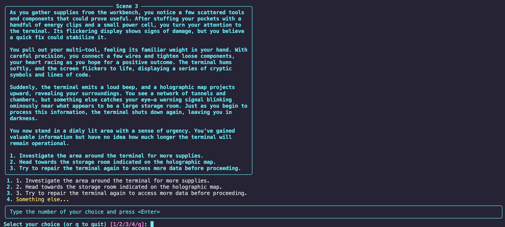
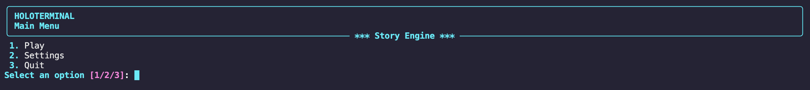
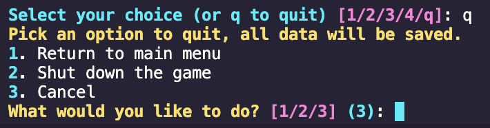
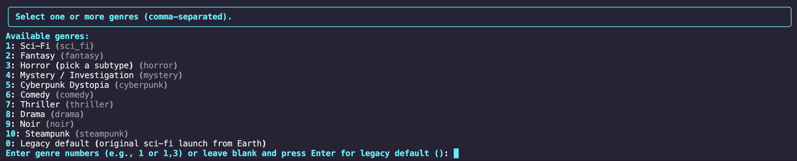
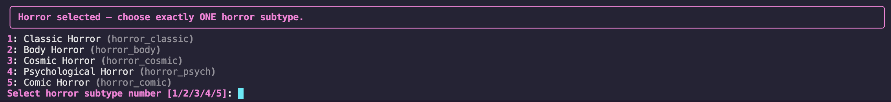
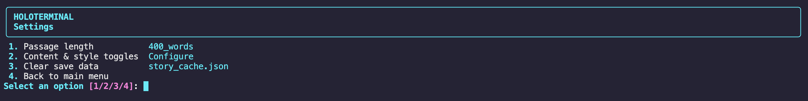
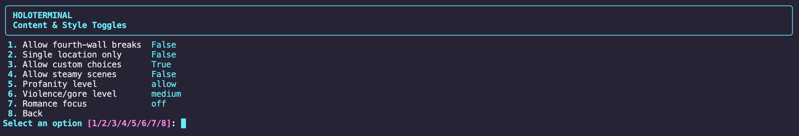

# CYOA_wAI 🚀

**An AI-powered choose-your-own-adventure game that creates a unique story around your choices.**

Play entirely in the terminal, choose from a wide variety of genres and settings, and let AI generate the story as you play.

---

## ✨ Features

* 🤖 **AI-generated stories**
* 📚 Multiple **genres and subgenres**
* 👣 **Checkpoints** which every story uses *(Toggling coming soon)*
* 🎭 Dynamic **NPC tracking**
* 📊 Player **stats and morality**
* 🎒 Inventory system *(in development)*
* ✏️ Custom player choices *(optional)*
* ⚙️ Customizable story settings
* 📖 Adjustable passage length
* 💾 Story caching
* 🖥️ Runs directly in the terminal

---

## 🎮 How It Works

The game generates a story based on your chosen genre and your decisions.

Each section of the story gives you several choices.

For example:

```
1. Enter the abandoned laboratory
2. Search the surrounding area
3. Walk away
```

Your decisions are remembered throughout the story, allowing the AI to build on what happened previously.

With **custom choices enabled**, you can also type your own actions instead of selecting one of the generated options.

---

## 🚀 Installation

### Requirements

* Python 3
* An OpenAI API key

### 1. Clone the repository

```
git clone https://github.com/Rueberry1/CYOA_wAI.git
cd CYOA_wAI
```

Alternatively you can download the files from the releases page

### 2. Install dependencies

The program will automatically install the required Python packages when launched. If it doesn't, check [This page](https://github.com/Rueberry1/CYOA_wAI/wiki/Installation-and-Running-The-Project)

### 3. Set your API key

Set your `OPENAI_API_KEY` environment variable before running the game.

### 4. Start the game

```
python3 ai_story_generation.py
```

### 5. Quiting the Game

Type **Command+C/Control+C** to quit the game. All data is saved automatically

---

## ⚙️ Settings

The game includes several settings that let you customize how stories are generated.

| Setting         | Description                                           |
| --------------- | ----------------------------------------------------- |
| Passage Length  | Controls how long each story segment is               |
| Custom Choices  | Allows you to enter your own actions                  |
| Fourth Wall     | Controls whether the story can acknowledge the player |
| Single Location | Keeps the story within one location                   |
| Profanity       | Controls the amount of profanity                      |
| Violence / Gore | Controls the level of violence                        |
| Romance         | Controls the story's romance focus                    |

---

<details>
<summary>📚 Genres</summary>

The game supports a wide range of genres and subgenres.

Some examples include:

* Science Fiction
* Fantasy
* Horror
* Mystery
* Adventure
* Crime
* Comedy
* Romance
* And more...

</details>

_Fun Fact, Comic Horror was created because of a typo trying to type Cosmic Horror!_

---

<details>
<summary>👣 Checkpoints</summary>

The game has **7** Checkpoints at various passages where the same thing happens every time (See [customisation](https://github.com/Rueberry1/CYOA_wAI/wiki/Customisation#checkpoints) to change them.

* 4: "Something unexpected or mysterious happens that shifts the player's understanding of their journey or surroundings and leads them to have a long term goal.",
* 18: "The player encounters a new world, culture, or phenomenon that challenges previous assumptions and offers new possibilities.",
* 27: "A situation arises where the player must make a difficult ethical or strategic choice, with no clearly right answer.",
* 40: "The consequences of earlier choices start to ripple out, changing available resources, allies, or goals in significant ways.",
* 55: "The player is presented with an opportunity or temptation that could lead their story in a radically new direction, if they choose to pursue it.",
* 80: "A personal loss or sacrifice tests the player's resolve and ambitions.",
* 100: "The story should now move toward a satisfying ending or resolution within the next few scenes.",

</details>

## Saving

When starting a game, you will be asked for a **Seed**. Seeds are unique identifiers you can re-enter later to continue from where you left off. Each seed is connected to the genre of the game, so you can have a seed 12345 for both Sci-Fi and Fantasy and they will both store seperate stories!

---

## 🧠 How the AI Works

The game uses the OpenAI API to generate story segments based on:

* Your chosen genre
* Previous choices
* Player statistics
* NPC information
* Story settings
* Custom actions

The Python program keeps track of important game state while the AI handles the narrative generation.

---

## 🛠️ Project Structure

```
CYOA_wAI/
├── ai_story_generation.py
├── ai_story_generation_core.py
├── ai_story_generation_ui.py
├── ai_story_generation_settings.py
├── ai_story_generation_genres.py
├── ai_story_generation_state.py
├── story_cache.json
└── README.md
```

---

## 📸 Screenshots



<table>
  <tr>
    <td align="center">
      <br>
      <sub>Main Menu</sub>
    </td>
    <td align="center">
      <br>
      <sub>Quitting the Game</sub>
    </td>
  </tr>
  <tr>
    <td align="center">
      <br>
      <sub>Picking Genres</sub>
    </td>
    <td align="center">
      <br>
      <sub>Picking a Horror Subgenre</sub>
    </td>
  </tr>
</table>




---

## 🤖 AI-Assisted Development

I use AI as a programming and learning tool while developing this project.

Parts of the code were created or improved with the help of AI, but I am actively learning and experimenting with the code myself.

---

## 📄 License

Licensed Under **MIT**

---

⭐ If you find this project interesting, feel free to check it out!
